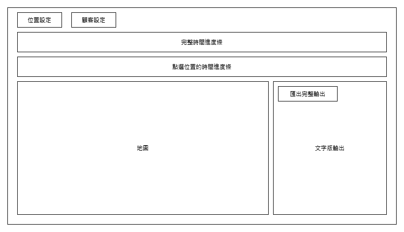

# 架構設計
## 視覺化介面排版設計

- 位置設定與顧客設定:根據題目設定的方式，按下會出現懸浮窗讓使用者做設定
- 地圖:會根據位置設定來自動呈現座位，會根據題目的座位樣式不同有不一樣的顏色或樣子
- 完整時間進度條: 設定完位置與顧客設定後程式會先運算完成，然後可以按啟動鍵撥放，地圖會根據時間展現甚麼時候有甚麼人坐在位子上，等待的人也要出現在地圖上的等候區(同個家庭的人要圈在一塊)，人根據題目類別有不同顏色或樣子，完整時間進度條可以點擊跳到想要的時間點，並且放在某個時間點上會用懸浮窗顯示有哪些家庭(與家庭有哪些人)再該時間點會出現。
- 點選位置的時間進度條: 在地圖中點擊某桌會在此呈現該桌每個那些時段有人坐，會用顏色條呈現一個家庭坐久多久，放在顏色條上會懸浮窗展示該顏色條是哪個家庭坐的(有哪些人)。在地圖中點擊家庭則會用色顏色條呈現該家庭在哪個時段出現待多久，可以選擇多個家庭，當選擇多個家庭時，會用不同色條呈現多個家庭出現的時段，當有家庭時段撞期，撞期的時段色條統一會呈現撞期家庭的顏色融合後用線框特別標示出來(或你可以幫我想怎麼呈現)，選擇多個家庭時，滑鼠在某時間點上會懸浮窗呈現該時間點是哪個家庭並且時間點撞期時懸浮窗會有多個家庭
- 文字版輸出:根據題目要求根據時間點用文字呈現結果(依照題目要求格式)
- 匯出完整輸出: 可以將完整的文字版輸出匯出成txt檔(根據題目要求格式)